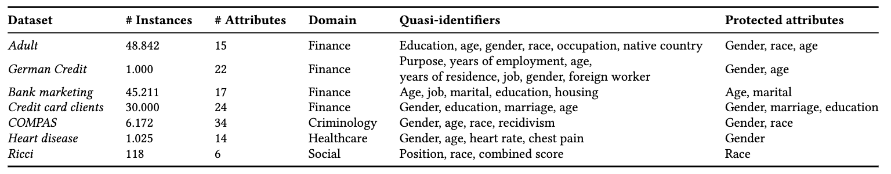

# A Three-Way Knot: Privacy, Fairness, and Predictive Performance Dynamics

The balance between privacy, fairness, and predictive performance is complex.
Therefore, we study this three-way tension and how the optimization of each vector impacts others.

The data used in this work is presented below.
